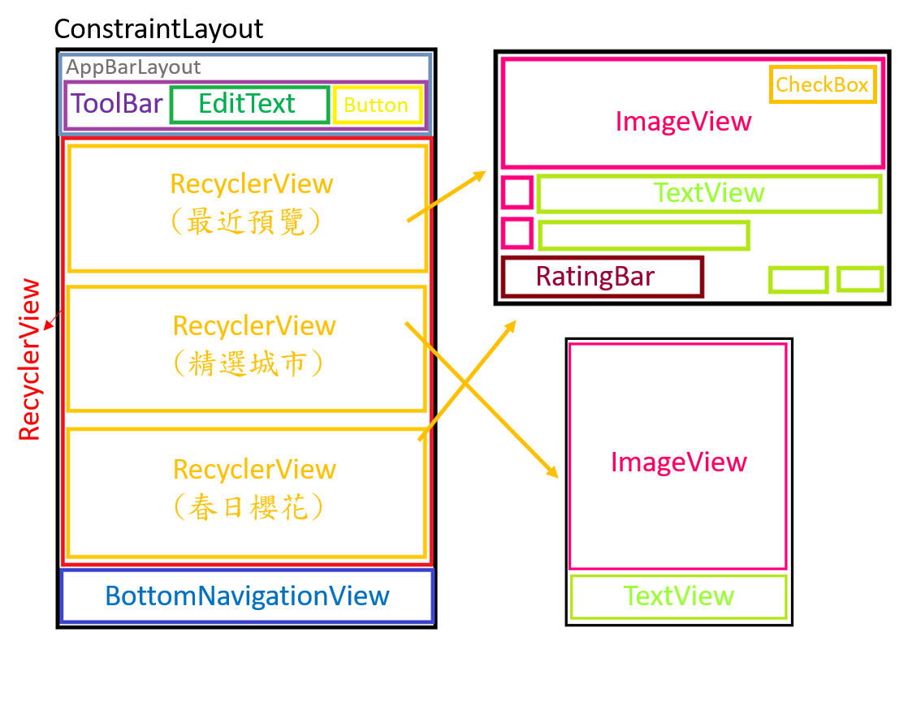
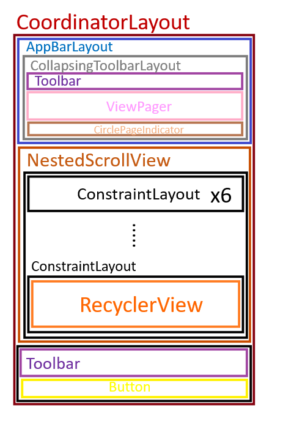

# KKday-UI
以App「KKdayUI」作範例，來練習UI佈局設計

## Views
* 首頁
  * Toolbar
  * EditText
  * Button
  * RecyclerView
  * BottomNavigationView
  
* 行程介紹
  * ViewPager
  * Toolbar
  * NestedScrollView
  * RecyclerView
  * Button
  
## ItemView
* CardView
* TextView
* CheckBox
* RatingBar
* ImageView

## Layout
* 首頁
  * ConstraintLayout
  * AppBarLayout
  
* 行程介紹
  * CoordinatorLayout
  * AppBarLayout
  * CollapsingToolbarLayout
  * ConstraintLayout
  
## 第三方
* Glide
* CirclePageIndicator

## 結構

* 主頁

* 旅遊頁面

## Demo

